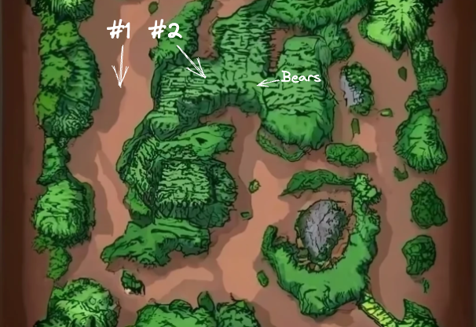

:::info Paved Path Series
This is Part 2 in a series of posts discussing Paved Paths between [Rick](https://www.rickroche.com/) and I.
- [Part 1 - Paved Paths: Let's talk about paved paths](https://www.rickroche.com/2023/04/paved-paths-series-part-1-lets-talk-about-paved-paths)
- [Part 3 - Paved Paths: Why Paved Paths?](https://www.rickroche.com/2023/05/paved-paths-series-part-3-why-paved-paths)
- [Part 4 - Paved Paths: The Anatomy of Paved Paths](https://christaceygreen.com/blog/paved-paths-series-part-4-the-anatomy-of-paved-paths)
:::

:::note Why just one page?
We both found ourselves needing to write a one-page summary of paved paths. This would most likely act as a landing page for someone to 'get the gist' of what these are. Low detail. Imagine the CxO of your company wants to know what these are.
:::

<!--truncate-->

# What is a paved path?
A paved path ensures that a well-trodden route is an easy, quick and safe way of reaching a clearly defined destination.

## Hiking
Imagine you're hiking through a woodland. Your destination is 'Chuck's Café', 4 miles away. You have a couple of options in this situation:
1. Woodland map in hand, follow the predefined path to the café.
2. Knife in hand, head directly into the bush, confident you have the navigation and athletic abilities to reach the café.

Clearly, #2 is a much more adventurous decision to make. It may result in you learning new skills, or honing your existing ones. It could drive you to solve problems in new, innovative ways. However, it will most likely cause you to reach the café much later than if you'd followed the predefined path, dishevelled and missing your watch.

Option #1 is our paved path. It is predictable, safe, and fast. It will need walkers to make very few decisions(maybe a fork or two), will be smooth to traverse, and protects them from the risks of the deeper woodland (see: Bears). It is also unlikely to yield any opportunities for innovation.

This is the equivalent of our Engineers aiming for their destination of a 'REST API'. Nothing is stopping them from taking the untrodden path, where they will define patterns from scratch, and solve all of the problems along the way. It takes time though. It's also risky; there may well be challenges the team hadn't even considered when they started the journey, like securing their API against internal attackers. A paved path takes care of all of this for them, and much like a cookie-cutter, allows them to produce, in this example, APIs of consistent quality in a predictable amount of time.

# Does this turn us into a stale assembly line?

No. But it could, if used incorrectly.

To succeed, we need exploitation **and** exploration. 

If all of our teams only ever follow a fixed paved path, innovation dies. The path never evolves. The destination never changes. The technical value of the company will slowly diminish, until we wake up and realise none of our customer base owns a fax machine anymore.

At the other extreme, if every team is adventuring into the woodland when 80% of them are trying to reach the same destination, we're not exploiting enough. We're solving the same problems in different ways, over and over again, instead of focusing on innovating elsewhere.

So... we need both. We need paved paths, which serves the 80% across common use cases. We deliver consistently and with quality. The 20% are in the woodland, exploring new paths, new patterns, new technologies. These new paths may become forks on the paved path, as destinations evolve. If we ensure a balance between exploitation and exploration, paved paths massively empower our engineers and the organisation as a whole, without ever becoming stale.

In part 3 we go into more detail on why organisations need paved paths - read it [here](https://www.rickroche.com/2023/05/paved-paths-series-part-3-why-paved-paths) !

Featured image background by [Austin Ban](https://unsplash.com/@austinban?utm_source=unsplash&utm_medium=referral&utm_content=creditCopyText) on [Unsplash](https://unsplash.com/photos/juHayWuaaoQ?utm_source=unsplash&utm_medium=referral&utm_content=creditCopyText)
Map image generated by [Craiyon](https://www.craiyon.com/), updated using [excalidraw](https://github.com/excalidraw/excalidraw)
