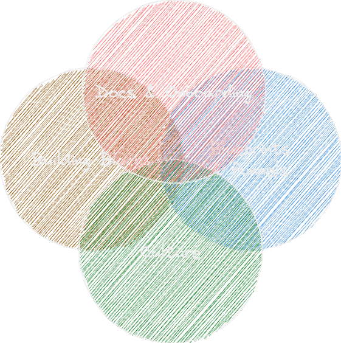
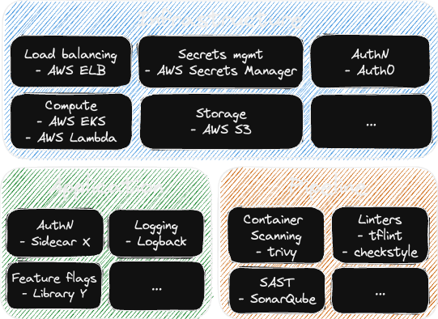
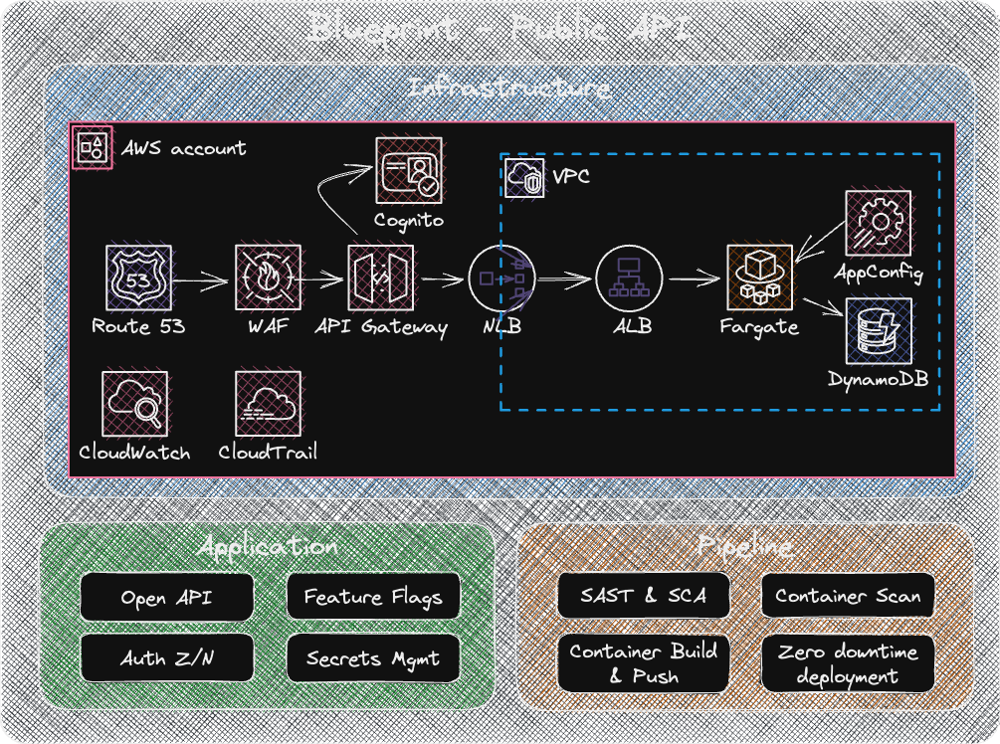
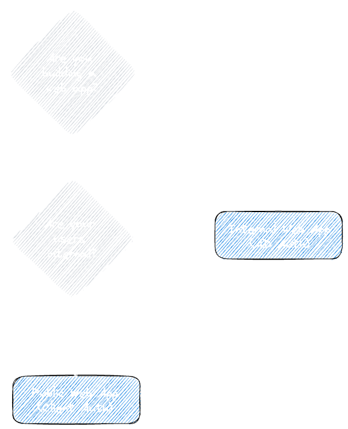

:::info Paved Path Series
This is Part 4 in a series of posts discussing Paved Paths between [Rick](https://www.rickroche.com/) and I.
- [Part 1 - Paved Paths: Let's talk about paved paths](https://www.rickroche.com/2023/04/paved-paths-series-part-1-lets-talk-about-paved-paths)
- [Part 2 - Paved Paths: One Pager](https://christaceygreen.com/blog/paved-paths-series-part-2-a-one-pager)
- [Part 3 - Paved Paths: Why Paved Paths?](https://www.rickroche.com/2023/05/paved-paths-series-part-3-why-paved-paths)
:::

In this post, we explore the inner workings of what makes up a paved path, aiming to demystify the components that will help you to realise the characteristics of a good paved path.

# What are they made of?

Paved paths will tend to be specific to your organisation, your tech stack and your principles but there are several questions that they should be able to answer, spanning four categories
- Building Blocks
- Blueprints & Funnels
- Documentation and Onboarding
- Culture

<!--truncate-->

## Building blocks

### Categorise your building blocks

:::info Answers the questions:
- When I need to perform "X" in my app/service, what tool/technology do I use?
- I want to "do X", do we have something in the organisation that enables that already?
- Do we have multiple technologies/tools doing the same thing? How do I know what to choose? What is the tools' lifecycle?
- To adopt this approach, what cultural changes are needed in the team?
:::

There are a general set of styles of building blocks that are useful here:

**Infrastructure building blocks** - ingress (load balancing, WAF etc), compute, secrets / config management, feature flags etc
- Think of all the components you need to bring your architecture to life

**Application building blocks** - internal libraries, common project structure, scaffolded apps with add-ins for observability, authN/Z, using config / secrets / feature flags etc
- e.g. Spring Initializr for Spring Boot projects or dotnet templates

**Workflow / process building blocks** - Dev(SecFin...)Ops
- Things that run in our pipelines - start small and increment here
	- e.g. Dependency management, SAST, SCA, tests, linters, cost management etc

:::caution
Make this a rule: **If it's not part of your pipeline, it doesn't exist**
:::

Write these building blocks down, they form a set of outlines that your paved paths aim to fill out over time, a roadmap of sorts. This can be as simple as a list on a wiki, modelled in software (Enterprise Architecture tools etc), loaded into an Internal Developer Portal or put into a picture. Make it accessible to all, easy to navigate and easy to update.

In your organisation, you will most likely find components that are fulfilled by multiple applications / libraries, a simple way to highlight the lifecycle of these is to use a technology radar and [Build your Own Radar](https://www.thoughtworks.com/radar/byor). This helps teams to decide what they should be phasing in, and phasing out.

### How to structure your building blocks

Whenever we think of building blocks, LEGO comes to mind. Keeping the building blocks composable is a great idea - you don't want your paved paths to become a new ball of mud.

For **infrastructure** building blocks, outputs could be layered Infrastructure as Code (IaC) modules
- Tier 1 - discrete components. e.g. a load balancer module, a WAF module
- Tier 2 - “LEGO” style building blocks, using tier 1. e.g. an application load balancer with WAF
-  Tier 3 - “DUPLO” style building blocks that enable infra needed to realise a blueprint - one click accelerators using tier 1 and 2. e.g. a public facing static web application

For **workflow / process** building blocks, outputs could be a pipeline template library
- Tier 1 - discrete jobs. e.g. build container, scan container, push to registry
- Tier 2 - “LEGO” style building blocks, orchestrating tier 1. e.g. build &rarr; scan &rarr; push to registry
-  Tier 3 - “DUPLO” style building blocks that enable common stages in a pipeline using tier 1 and tier 2
- Tier 4 - full end-to-end pipelines for specific blueprints or generic pipeline structures. e.g. Full CI/CD spanning multiple environments

Adding extensibility points to all pipeline templates in tiers 3/4 will help to avoid duplication where teams want "almost" whats there.

For **application** building blocks, outputs could be internal code libraries, such as `npm` or `nuget` packages
- Tier 1 - base functionality, following engineering standards. e.g. Logging implementation. Authentication middleware.
- Tier 2 - "LEGO" style building blocks, using tier 1, combining into a common bootstrapping library. e.g. ServiceCollection extension methods for a REST API setting up auth middleware and standard logging of HTTP requests.
- Tier 3 - "DUPLO" style building blocks, using tier 1 and tier 2, that implement a common pattern or process. e.g. A base class for event-driven handlers, implementing an inbox pattern and standard event handling methods.

Think about what guard rails can be put in place for each building block. We like the "prevent / detect / guide" model:
- **Prevent** controls stop teams from doing things that violate a policy or standard. E.g. preventing the creation of a load balancer exposing HTTP or preventing the push of a build of an image that has critical vulnerabilities to your registry.
- **Detect** controls allow teams to do things that may not be perfect, or mitigated by other controls but allow them to proceed and then a secondary process monitors them.
- **Guide** controls are simply guidance and lessons learnt in using different components.

The goal is to enable teams to move quickly and safely, enabling them to compose their own high-quality solutions using the building blocks. This is where we would push for the inclusion of standards, to make it easy for teams to do the "right things".

## Blueprints and funnels

:::info Answers the questions:
- What are the common patterns / deployment options that are supported?
- When I need to do Z, is there a set of accelerators that bootstrap my starting point?
- For my use-case how do I know what paved path to choose?
:::

Outputs would be common blueprints for popular use cases, highlighting technology choices, non-functional characteristics and security. Blueprints should select the building blocks needed to realise the desired architecture, compose them together and provide tooling that allows teams to bootstrap and go. **Blueprints are not pretty pictures - they are evolving software**.

E.g.
- A Java based internal API
- A Python based public API
- A .NET based asynchronous service
- A public facing static web application

The focus should be on enabling self-service. Iterating on this tooling with teams is critically important; we can easily get stuck into months of development building a CLI tool that no one will use. Make these blueprints accessible, get feedback from your users and iterate.

Examples would be (from basic to advanced)
- A set of steps on a wiki, illustrating which steps to follow
- Repositories with fully functional code (app & infra) that teams can clone, run and modify
- A CLI tool that walks them through a wizard, creating repo's, infrastructure and pipelines as needed

**Funnels** are decision trees that allow teams to walk through their use case and end up selecting the correct blueprint. E.g. Asking questions around the users or systems that interact with the service being built. These questions will lead to different blueprints: one for client credential grant flow or one for PKCE. Or helping a team decide if their service is public facing and needs to be protected by a public facing WAF directly.

## Culture

Interwoven throughout your paved paths will be elements that influence the way your teams work. You may be moving teams towards trunk-based development or separating release and deployment using feature flags. Without guidance as to the why, and how to use the techniques effectively, your paved paths with struggle to gain traction, adoption and success.

Similarly, by shifting functions left, or enabling autonomy, there will be new responsibilities that teams are now accountable for. These need to be articulated, discussed and understood by all involved - you cannot over communicate these cultural changes.

Spend time with the teams adopting your paved paths, understand what aspects of their daily processes are affected and help them adjust. It could be as simple as sharing links such as [Ship / Show / Ask](https://martinfowler.com/articles/ship-show-ask.html) to help them decide when to push straight to trunk. Spend time with engineering managers and agile practitioners in your organisation to help them understand these changes as well. Processes will need to be adapted and updated.

Characteristics of a healthy culture, ready for paved paths would be:
- A continuous improvement mindset
- An organisation sponsoring long-term value, rather than short-term wins
- Collaborative, proactive communication and knowledge sharing
- Iterative and incremental development
- Embracing DevOps practices, see [Culture - Continuous Delivery](https://continuousdelivery.com/implementing/culture/)

**Communicate. Listen. Iterate - As a collective.**

## Documentation and Onboarding

When thinking of how to catalogue and share paved paths, the first thing that will most likely jump to mind is [backstage.io](https://backstage.io/) or similar Internal Developer Portal (IDP). We will immediately temper the enthusiasm. Getting an IDP setup and showcasing all your paved paths will take time, time that could be better spent creating more building blocks and blueprints. You will most likely end up with an IDP, but gradually work towards that goal - a shiny portal doesn't enable teams to be autonomous or get up and running quickly, but a good set of building blocks, blueprints and a well-written `README.md` will.

Split your documentation into two categories - one for the users of the paved paths (your engineers) and one for contributors to the paved paths. This will allow you to focus on enablement for engineers using the paved paths and separate, deep, technical "how this all works" style documentation. 

Inside each of these categories, using the [Divio Documentation System](https://documentation.divio.com/) is a great place to start. It provides simple principles to guide how your documents be structured into four functions: tutorials, how-to guides, reference and explanation. Keep the functions distinct from one another and split into the two audience categories. E.g. Under tutorials for your engineers, you would expect to find a tutorial on getting an API into production. Under tutorials for your contributors, you would expect to find a tutorial on adding a new terraform module to your infrastructure building blocks.

:::tip 
The key thing to keep in mind at all times is the journey that the hikers are taking through your documentation. Put yourself in their shoes, blank out everything you already know, and stare at the woodland with fresh eyes. How well does your documentation hold up? Is it clear where to start? Is it intuitive to navigate? Can your great tooling actually be discovered? If an internal tool drops in the forest, but no one is around to hear it, does it make a sound?
:::

Getting teams started using your paved paths is critical to their success and should be straight-forward. Teams using your documentation will test it - no documentation will survive first contact with them and this feedback is vital to help you improve. When onboarding teams, make feedback loops on the experience explicit - create mechanisms for them to ask questions, provide feedback and enable you to learn. Make getting help a first class citizen, add `--help`  to all your tools with links to your documentation, create a messaging channel for questions and answers. Questions your users have will highlight gaps in the developer experience as well as places that require more enablement help. Similarly, make giving feedback a first class citizen - don't be afraid to poll your users.

With whatever we produce, the vital thing is that we're treating our paved paths with the respect they deserve. Just as we have UX (user experience) for our client-facing products, we have DX (developer experience) for our paved paths. Fundamentally, all the same techniques should be used here as we would use for client-facing products. Research, agile methodologies, continuous feedback, continuous improvement. To succeed, we can use techniques we're already familiar with, the only difference is that our customer is an engineer!

Next, in part 5, we'll discuss where Platform Engineering comes into all of this, and whether you need it to build paved paths.

## References

- [The Twelve-Factor App](https://12factor.net/)
- [Build your Own Radar | Thoughtworks](https://www.thoughtworks.com/radar/byor)
- [What is a Paved Path?.by Matt Stine | CodeX | Medium](https://medium.com/codex/what-is-a-paved-path-b2294463a3a9)
- [Create your Paved Roads (hella-secure.com)](https://www.hella-secure.com/post/create-your-paved-roads)
- [Paving the Road to Production (infoq.com)](https://www.infoq.com/articles/paving-road-production-coinbase/)
- [Designing Golden Paths (redhat.com)](https://cloud.redhat.com/blog/designing-golden-paths)
- [How We Use Golden Paths to Solve Fragmentation in Our Software Ecosystem - Spotify Engineering : Spotify Engineering (atspotify.com)](https://engineering.atspotify.com/2020/08/how-we-use-golden-paths-to-solve-fragmentation-in-our-software-ecosystem/)